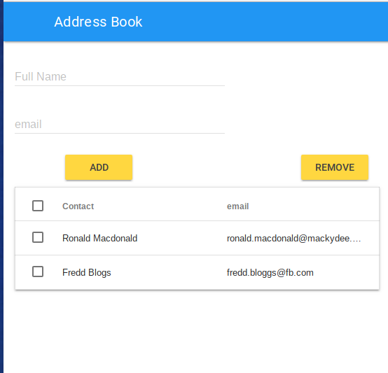

# MDL-Dynamic-Tables
Example Code that shows how to add and remove lite Material Design Lite Tables with checkboxes

There were a number of bugs in Material Design Lite tables with checkboxes in the table rows.
As a result Google deprecated the auto generation of checkboxes with MDL with mdl-data-table--selectable.

https://github.com/google/material-design-lite/wiki/Deprecations

This sample code shows a simple address book using dynamic table entries.
In particular it shows how to get the state of the check boxes which is not well documented

Additionally CSS markup has been added to build a responsive table restricting the checkbox to a smaller col on the left of the table.
Table cols have also been truncated in small screes to hide overflow.

